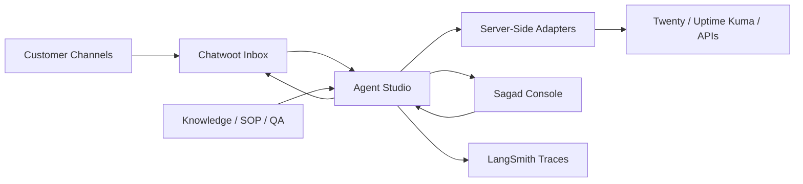

# Sagad OS

Sagad OS is an open-source, self-hostable AI operations platform for AI-native BPO and contact-center workflows.

It coordinates inboxes, CRMs, knowledge bases, approvals, QA, observability, and tool execution through a supervised AI operations layer. Sagad OS does not replace every tool. It connects them through controlled server-side adapters.

> Status: early preview. Sagad OS is not production-hardened yet.

## What Ships In v0.1

Sagad OS is a self-hosted open-source reference OS with Chatwoot and Twenty adapters, two AI agents, SOP/RAG knowledge, confidence thresholds, a supervisor approval queue, audit logs, basic AI Ops reporting, seed demo data, Docker setup, and contributor docs.

The repo should make these things obvious quickly:

- Sagad OS is for AI-native BPO, agency, and service operations.
- It connects to existing tools instead of replacing them.
- It uses agents, approved knowledge, supervisor approvals, and audit logs.
- It is self-hostable.
- Chatwoot and Twenty are reference adapters.
- Developers can build more adapters.
- Operators can supervise AI safely.

## What It Does

Sagad OS is built around the golden demo loop:

```text
customer message enters Chatwoot
-> Sagad OS classifies the message
-> Sales Agent or Support Agent is selected
-> agent pulls from approved SOP / knowledge base
-> agent drafts a response
-> trust score is calculated
-> high-trust response can auto-send
-> low-trust response enters the approval queue
-> supervisor approves, edits, rejects, or escalates
-> Sagad OS logs the full decision trail
-> dashboard shows automation rate, approvals, rejections, and missing knowledge
```

The first target workflow follows the canonical blueprint: customer channels flow into Chatwoot, Agent Studio orchestrates the conversation with governed knowledge, policy checks, tool adapters, and LangSmith traces, then the Supervisor Console approves or escalates before any reply is delivered.

## Core Architecture



## Product Modules

| Module | Responsibility |
|---|---|
| Sagad Core | The orchestration engine |
| Sagad Agents | Sales and Support AI agents |
| Sagad Knowledge | Approved SOP, policy, FAQ, and retrieval layer |
| Sagad Approvals | Human supervisor review queue |
| Sagad Adapters | Chatwoot, Twenty, webhooks, and future tools |
| Sagad Audit | Trace logs for every AI decision |
| Sagad Console | Operator UI for supervisors and admins |

## Demo Workspace

Do not bring your own data first. The preview starts with `Northstar Apparel Support` demo data:

- Chatwoot demo inbox conversations;
- Twenty CRM-style contacts;
- demo refund policy;
- demo shipping FAQ;
- demo escalation rules;
- AI-drafted replies;
- approval states;
- audit logs;
- basic AI Ops reports.

The first screen shows `TODAY'S AI OPS` metrics, including messages received, AI drafted replies, auto-sent replies, supervisor approvals, escalations, rejections, and the top missing knowledge topic.

### Sagad Console

The supervisor UI for queues, approvals, conversations, agent performance, contact drivers, QA/SOP review, knowledge inventory, the operator/admin Integrations page, and Settings.

The console direction follows the SagadOS Premium Open Ops design system: calm, modular, inspectable, and operator-focused. Product surfaces should show visible system state, clear borders, restrained navy/teal accents, and transparent ownership rather than AI-magic or glossy SaaS framing.

Integrations is for operator health monitoring and Owner/Admin connection setup. Developer payloads, DTO contracts, webhook samples, and low-level tool details belong under `Settings -> Advanced`, not in the main integrations page.

Location: `v1/`

The profile menu also includes a SuperAdmin Console for instance-level visibility: workspaces, users, platform apps, LangGraph app setup, LiteLLM model gateway readiness, and runtime health. This is for self-host operators and maintainers, not daily queue review.

### Agent Studio

The backend orchestration layer. It owns typed LangGraph state, LangChain tools, adapter policy, approval gates, knowledge retrieval, draft generation, trace metadata, and approved external actions.

Agent Studio also owns provider connection configuration. Chatwoot and Twenty CRM credentials are saved through Agent Studio and stored as encrypted Sagad Postgres secret versions when `DATABASE_URL` is configured. Browser code only receives redacted status fields such as configured flags, health, missing fields, and dry-run/write-gate state.

It also includes `langgraph.json` for official LangSmith Studio visual debugging of the local `sagad_conversation` graph. Studio is for graph design and inspection; the Sagad Console is for supervisor operations.

LiteLLM is supported as an optional OpenAI-compatible model gateway so Agent Studio can test OpenAI and DeepSeek credits through one server-side endpoint.

Location: `agent-studio/`

### External Systems

Sagad OS coordinates external systems through Agent Studio adapters:

- Chatwoot for channel intake and approved replies.
- Twenty CRM for customer and lead context.
- Uptime Kuma for infrastructure health later.
- LangSmith for traces and observability.
- MCP/FastMCP as a future tool exposure layer behind Agent Studio.

Browser code must not call provider APIs directly. Owner and Admin users may edit connection setup through the console; Supervisor users get read-only integration health for monitoring and review.

## Demo Videos

Video demos are planned but not published yet.

Planned walkthroughs:

- Sagad Console overview.
- Chatwoot human-in-the-loop reply flow.
- Agent Studio architecture.
- Self-hosted VPS deployment.
- Future MCP/FastMCP connector model.

## Current Repository

```text
.
|-- v1/                 # Next.js supervisor console
|-- agent-studio/       # FastAPI + LangGraph backend preview
|-- docs/blueprints/    # Architecture and implementation blueprints
|-- docs/*.md           # Getting started, architecture, adapters, agents, knowledge, approvals, audit, deployment, roadmap
|-- docs/CI-CD.md       # CI and future CD model
|-- docs/DEPLOYMENT.md  # Container and VPS deployment notes
|-- docs/VERSIONING.md  # Release/versioning policy
|-- QUICKSTART.md       # Technical setup guide
|-- CONTRIBUTING.md     # Contributor workflow
|-- SECURITY.md         # Security policy
|-- compose.preview.yaml
|-- compose.vps.example.yaml # Example Nginx Proxy Manager / shared-network VPS stack
```

## Requirements

- Node.js and npm for the console.
- Python 3.12+ for Agent Studio.
- `uv` for Python dependency management.
- Docker for container builds.
- Optional external services: Chatwoot, Twenty CRM, Uptime Kuma, LangSmith.

## Quick Start

Read `QUICKSTART.md` for the full setup guide.

New contributors can also start with:

- `docs/getting-started.md`
- `docs/architecture.md`
- `docs/adapters.md`
- `docs/agents.md`
- `docs/rag-pipeline.md`
- `docs/approval-queue.md`
- `docs/audit-log.md`
- `docs/DEPLOYMENT.md`
- `docs/contributing.md`
- `docs/roadmap.md`

### Frontend

```powershell
cd v1
npm install
npm run dev
```

Verification:

```powershell
npm run lint
npx tsc --noEmit --pretty false
npm run build
```

### Agent Studio

```powershell
cd agent-studio
uv sync
uv run pytest
uv run uvicorn agent_studio.main:app --reload --port 8010
```

Useful local endpoints:

- `GET /health`
- `GET /health/live`
- `GET /health/ready`
- `GET /integrations`
- `GET /integrations/twenty/health`
- `GET /integrations/litellm/health`
- `GET /integration-configs`
- `PUT /integration-configs/{provider}`
- `POST /integration-configs/{provider}/disable`
- `POST /integration-configs/{provider}/test`
- `POST /webhooks/chatwoot`
- `GET /conversations`
- `GET /conversations/{id}`
- `POST /conversations/{id}/approve-send`
- `WS /ws/conversations`

### Docker Preview

```powershell
docker compose -f compose.preview.yaml build
docker compose -f compose.preview.yaml up -d
```

Optional LiteLLM gateway:

```powershell
docker compose -f compose.preview.yaml --profile litellm up -d --build
```

VPS deployments that already use Nginx Proxy Manager and a shared external Docker network can copy the example:

```bash
cp .env.example .env
cp compose.vps.example.yaml compose.vps.yaml
# Edit .env and compose.vps.yaml for the target VPS.
docker compose -f compose.vps.yaml up -d --build
```

In Nginx Proxy Manager, point the proxy host to:

```text
sagad-console:3000
```

Default ports:

- Sagad Console: `3000`
- Agent Studio: `8010`
- Sagad Postgres/pgvector: `5433`

## Integration Path

Owners and Admins configure Chatwoot and Twenty CRM from the operator/admin Integrations page. Agent Studio stores the connection metadata and encrypts provider secrets in Sagad Postgres when persistence is enabled. Supervisors can see setup health, dry-run state, and missing-field guidance, but cannot edit provider credentials.

The first live milestone is:

```text
real Chatwoot message
-> Agent Studio receives webhook
-> Agent Studio upserts one Sagad thread per Chatwoot conversation
-> knowledge/SOP context is retrieved
-> optional Twenty CRM context is loaded
-> AI draft is created
-> supervisor approves
-> reply sends back through Chatwoot
-> audit and trace are recorded
```

Repeated messages from the same Chatwoot session append to the same Sagad conversation row. The console can use Agent Studio WebSocket events to refresh queue and review screens without manual reload.

Twenty CRM starts read-only. External writes remain disabled or dry-run until human approval gates and write-policy tests are verified.

## Deployment Model

Sagad OS is designed for:

- self-hosted deployments;
- managed hosting later;
- client-owned deployments for high-risk environments.

The first preview deployment can run beside Chatwoot, Twenty CRM, and Uptime Kuma on a single VPS.

```text
VPS
|-- Chatwoot
|-- Twenty CRM
|-- Uptime Kuma
|-- Sagad Console
`-- Agent Studio
```

The current preview includes the first database and auth foundation: Auth.js for console sessions, Sagad Postgres with pgvector in preview compose, tenant-scoped Sagad tables, durable Agent Studio conversation/approval/tool/audit rows, and the accepted encrypted integration-secret storage model when `DATABASE_URL` is configured. Production still needs hardened key management, backups, migration operations, auth runbooks, and pgvector-backed retrieval validation.

## CI/CD And Versioning

GitHub Actions currently verify:

- frontend lint, typecheck, and build;
- Agent Studio tests;
- container build smoke tests;
- preview compose boot plus Agent Studio health/readiness checks.

The Docker publish workflow can push versioned Sagad Console and Agent Studio images to GitHub Container Registry on tags or manual dispatch. It does not deploy to a VPS yet.

See:

- `docs/CI-CD.md`
- `docs/VERSIONING.md`
- `docs/DEPLOYMENT.md`

Current version: `0.1.0`

## Roadmap

Current:

- Next.js supervisor console preview.
- Agent Studio FastAPI + LangGraph backend preview.
- Northstar Apparel Support seeded demo workspace.
- Golden demo loop with sample conversations, drafts, approvals, audit trail events, and basic AI Ops metrics.
- Chatwoot and Twenty operator/admin setup and monitoring boundaries.
- Docker and CI scaffolding.
- Auth.js console session foundation.
- Sagad Postgres/pgvector schema foundation.
- Optional Agent Studio Postgres persistence for conversations, approvals, tool rows, and audit events.
- Accepted Agent Studio encrypted connection config contract for Chatwoot and Twenty.

Next:

- Operator/admin Integrations page wired to Agent Studio connection config endpoints.
- `Settings -> Advanced` developer view for payloads, DTO contracts, and webhook/tool samples.
- Live Chatwoot webhook loop.
- Twenty CRM read-only context.
- Human-in-the-loop approved send back to Chatwoot.
- Uptime Kuma read-only health visibility.
- pgvector-backed governed knowledge retrieval.

Later:

- connector registry;
- managed hosting path;
- auth and tenant isolation;
- production secret management;
- durable LangGraph checkpoints;
- MCP/FastMCP read-only tool exposure;
- write tools behind approval and audit gates;
- high-risk account workflows.

## Contributing

Read `CONTRIBUTING.md` before opening a pull request.

Contribution rules:

- Keep provider credentials server-side in Agent Studio.
- Do not add browser-direct calls to external tools.
- Keep high-risk writes behind approval gates.
- Preserve typed frontend contracts and typed Agent Studio state.
- Use `uv` for Python dependency management.
- Avoid deprecated LangChain `Chain` classes.
- Update public docs when setup, behavior, architecture, or integration contracts change.

## Security

Read `SECURITY.md` before using Sagad OS with customer data.

The current preview is not production-hardened. Do not use it for regulated or high-risk customer data without reviewing auth, audit, tenant isolation, retention, backups, and secret management.

## License

A license file should be added before the first stable public release.
