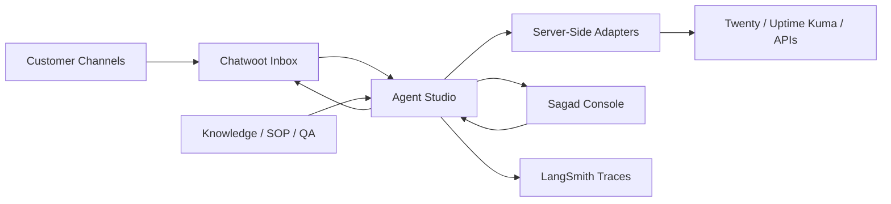

# Sagad OS

Sagad OS is an open-source, self-hostable AI operations platform for AI-native BPO and contact-center workflows.

It coordinates inboxes, CRMs, knowledge bases, approvals, QA, observability, and tool execution through a supervised AI operations layer. Sagad OS does not replace every tool. It connects them through controlled server-side adapters.

> Status: early preview. Sagad OS is not production-hardened yet.

## What It Does

Sagad OS is built around one operating loop:

```text
customer message
-> channel intake
-> AI orchestration
-> knowledge and tool context
-> draft response
-> human approval
-> approved customer reply or external action
-> audit and trace
```

The first target workflow follows the canonical blueprint: customer channels flow into Chatwoot, Agent Studio orchestrates the conversation with governed knowledge, policy checks, tool adapters, and LangSmith traces, then the Supervisor Console approves or escalates before any reply is delivered.

## Core Architecture



### Sagad Console

The supervisor UI for queues, approvals, conversations, agent performance, contact drivers, QA/SOP review, knowledge inventory, integrations, and settings.

Location: `v1/`

### Agent Studio

The backend orchestration layer. It owns typed LangGraph state, LangChain tools, adapter policy, approval gates, knowledge retrieval, draft generation, trace metadata, and approved external actions.

Location: `agent-studio/`

### External Systems

Sagad OS coordinates external systems through Agent Studio adapters:

- Chatwoot for channel intake and approved replies.
- Twenty CRM for customer and lead context.
- Uptime Kuma for infrastructure health later.
- LangSmith for traces and observability.
- MCP/FastMCP as a future tool exposure layer behind Agent Studio.

Browser code must not call provider APIs directly.

## Demo Videos

Video demos are planned but not published yet.

Planned walkthroughs:

- Sagad Console overview.
- Chatwoot human-in-the-loop reply flow.
- Agent Studio architecture.
- Self-hosted VPS deployment.
- Future MCP/FastMCP connector model.

## Current Repository

```text
.
|-- v1/                 # Next.js supervisor console
|-- agent-studio/       # FastAPI + LangGraph backend preview
|-- docs/blueprints/    # Architecture and implementation blueprints
|-- docs/CI-CD.md       # CI and future CD model
|-- docs/DEPLOYMENT.md  # Container and VPS deployment notes
|-- docs/VERSIONING.md  # Release/versioning policy
|-- QUICKSTART.md       # Technical setup guide
|-- CONTRIBUTING.md     # Contributor workflow
|-- SECURITY.md         # Security policy
|-- compose.preview.yaml
|-- compose.vps.example.yaml # Example Nginx Proxy Manager / shared-network VPS stack
```

## Requirements

- Node.js and npm for the console.
- Python 3.12+ for Agent Studio.
- `uv` for Python dependency management.
- Docker for container builds.
- Optional external services: Chatwoot, Twenty CRM, Uptime Kuma, LangSmith.

## Quick Start

Read `QUICKSTART.md` for the full setup guide.

### Frontend

```powershell
cd v1
npm install
npm run dev
```

Verification:

```powershell
npm run lint
npx tsc --noEmit --pretty false
npm run build
```

### Agent Studio

```powershell
cd agent-studio
uv sync
uv run pytest
uv run uvicorn agent_studio.main:app --reload --port 8010
```

Useful local endpoints:

- `GET /health`
- `GET /integrations`
- `GET /integrations/twenty/health`
- `POST /webhooks/chatwoot`
- `GET /conversations`
- `GET /conversations/{id}`
- `POST /conversations/{id}/approve-send`

### Docker Preview

```powershell
docker compose -f compose.preview.yaml build
docker compose -f compose.preview.yaml up -d
```

VPS deployments that already use Nginx Proxy Manager and a shared external Docker network can copy the example:

```bash
cp .env.example .env
cp compose.vps.example.yaml compose.vps.yaml
# Edit .env and compose.vps.yaml for the target VPS.
docker compose -f compose.vps.yaml up -d --build
```

In Nginx Proxy Manager, point the proxy host to:

```text
sagad-console:3000
```

Default ports:

- Sagad Console: `3000`
- Agent Studio: `8010`
- Sagad Postgres/pgvector: `5433`

## Integration Path

The first live milestone is:

```text
real Chatwoot message
-> Agent Studio receives webhook
-> Agent Studio creates typed conversation state
-> knowledge/SOP context is retrieved
-> optional Twenty CRM context is loaded
-> AI draft is created
-> supervisor approves
-> reply sends back through Chatwoot
-> audit and trace are recorded
```

Twenty CRM starts read-only. External writes remain disabled or dry-run until human approval gates and write-policy tests are verified.

## Deployment Model

Sagad OS is designed for:

- self-hosted deployments;
- managed hosting later;
- client-owned deployments for high-risk environments.

The first preview deployment can run beside Chatwoot, Twenty CRM, and Uptime Kuma on a single VPS.

```text
VPS
|-- Chatwoot
|-- Twenty CRM
|-- Uptime Kuma
|-- Sagad Console
`-- Agent Studio
```

The current preview includes the first database and auth foundation: Auth.js for console sessions, Sagad Postgres with pgvector in preview compose, tenant-scoped Sagad tables, and durable Agent Studio conversation/approval/tool/audit rows when `DATABASE_URL` is configured. Production still needs hardened secret management, backups, migration operations, encrypted tenant secrets, auth runbooks, and pgvector-backed retrieval validation.

## CI/CD And Versioning

GitHub Actions currently verify:

- frontend lint, typecheck, and build;
- Agent Studio tests;
- container build smoke tests.

See:

- `docs/CI-CD.md`
- `docs/VERSIONING.md`
- `docs/DEPLOYMENT.md`

Current version: `0.1.0`

## Roadmap

Current:

- Next.js supervisor console preview.
- Agent Studio FastAPI + LangGraph backend preview.
- Mocked home-services operating data.
- Chatwoot and Twenty integration boundaries.
- Docker and CI scaffolding.
- Auth.js console session foundation.
- Sagad Postgres/pgvector schema foundation.
- Optional Agent Studio Postgres persistence for conversations, approvals, tool rows, and audit events.

Next:

- Live Chatwoot webhook loop.
- Twenty CRM read-only context.
- Human-in-the-loop approved send back to Chatwoot.
- Uptime Kuma read-only health visibility.
- pgvector-backed governed knowledge retrieval.

Later:

- connector registry;
- managed hosting path;
- auth and tenant isolation;
- production secret management;
- durable LangGraph checkpoints;
- MCP/FastMCP read-only tool exposure;
- write tools behind approval and audit gates;
- high-risk account workflows.

## Contributing

Read `CONTRIBUTING.md` before opening a pull request.

Contribution rules:

- Keep provider credentials server-side in Agent Studio.
- Do not add browser-direct calls to external tools.
- Keep high-risk writes behind approval gates.
- Preserve typed frontend contracts and typed Agent Studio state.
- Use `uv` for Python dependency management.
- Avoid deprecated LangChain `Chain` classes.
- Update public docs when setup, behavior, architecture, or integration contracts change.

## Security

Read `SECURITY.md` before using Sagad OS with customer data.

The current preview is not production-hardened. Do not use it for regulated or high-risk customer data without reviewing auth, audit, tenant isolation, retention, backups, and secret management.

## License

A license file should be added before the first stable public release.
