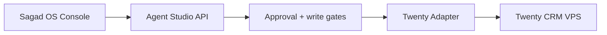

# Twenty External VPS

Twenty CRM is external infrastructure for Sagad OS. It can run on a separate VPS, but it is not bundled into Sagad OS and should not be treated as an internal subsystem.

## Boundary

Sagad OS coordinates Twenty through Agent Studio:



The browser calls Sagad OS APIs only. Agent Studio owns Twenty credentials, health checks, lookups, note creation, task creation, lead-stage updates, retries, audit metadata, and trace links.

## Environment

Set these in the Agent Studio environment only:

- `TWENTY_ENABLED=false`
- `TWENTY_BASE_URL=`
- `TWENTY_API_KEY=`
- `TWENTY_API_MODE=graphql`
- `TWENTY_DRY_RUN=true`
- `TWENTY_ALLOW_WRITES=false`
- `TWENTY_TIMEOUT_SECONDS=20`

Default mode is safe: disabled and dry-run. Enable reads first, then enable writes only after approval logging is working.

## Verification

```powershell
uv run pytest
uv run uvicorn agent_studio.main:app --reload --port 8010
Invoke-WebRequest -UseBasicParsing http://127.0.0.1:8010/integrations/twenty/health
```
