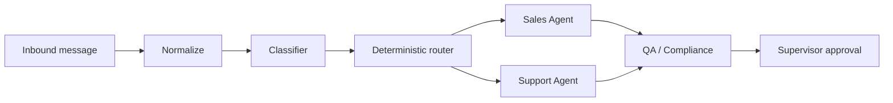

# Agents

Sagad OS v0.1 keeps the agent model intentionally small.

## Included Agents

| Agent | Scope |
|---|---|
| Sales Agent | Sizing, pricing, purchase readiness, lead qualification |
| Support Agent | Order status, returns, refunds, account support, tool failures |

Discovery is not a separate agent in v0.1. Sales and Support agents ask probing questions when the customer intent is unclear.

## Workflow

Agents should use approved knowledge, calculate a trust score, and never perform high-risk writes without an approval path.

## Agent CRUD Management

Supervisors can dynamically configure and manage AI agents directly from the **Agent Configuration** panel in the `/agents` page.

* **Storage**: Configurations are saved as Markdown files with YAML frontmatter in `agent-studio/agent_studio/agents/`.
* **Registry Sync**: The registry dynamically reloads and updates when agents are created, edited, or deleted.
* **API Endpoints**:
  * `POST /agents` — Saves or updates an agent config file.
  * `DELETE /agents/{agent_id}` — Deletes an agent config file.

## Streaming Draft Generation

Operators can regenerate drafts and watch tokens stream in real-time in the supervisor console:

* **Endpoint**: `GET /conversations/{conversation_id}/draft/stream` returns an SSE event stream (`text/event-stream`).
* **Regeneration UI**: Conversations with existing drafts display a **Regenerate** button in the draft panel. Clicking it triggers the streaming endpoint and progressively renders the tokens into the draft textarea.
* **Persistence**: Once the stream completes, the final text draft is persisted to the conversation database.
