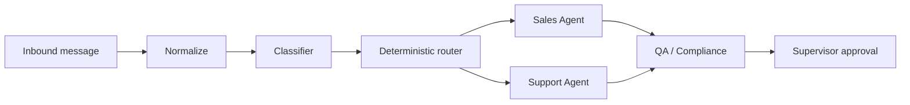

# Agents

Sagad OS v0.1 keeps the agent model intentionally small.

## Included Agents

| Agent | Scope |
|---|---|
| Sales Agent | Sizing, pricing, purchase readiness, lead qualification |
| Support Agent | Order status, returns, refunds, account support, tool failures |

Discovery is not a separate agent in v0.1. Sales and Support agents ask probing questions when the customer intent is unclear.

## Workflow

Agents should use approved knowledge, calculate a trust score, and never perform high-risk writes without an approval path.

## Agent CRUD Management

Supervisors can dynamically configure and manage AI agents directly from the **Agent Configuration** panel in the `/agents` page.

* **Storage**: Configurations are saved as Markdown files with YAML frontmatter in `agent-studio/agent_studio/agents/`. The body is the `system_prompt`; frontmatter keys are `name`, `intents`, `allowed_tools`, plus optional `description`, `model`, `tier`, and `voice`. Optional keys are only written when set, so existing agent files stay minimal.
* **Registry Sync**: The registry dynamically reloads and updates when agents are created, edited, or deleted.
* **Editable fields**:
  * `system_prompt` — the agent's voice/instructions (drives the sub-agent's `draft_hint`, which becomes the customer-facing reply when no tools run).
  * `intents` / `allowed_tools` — routing intents and server-side tool permissions.
  * `description` — short summary shown on the agent card (UI only).
  * `model` — optional per-agent model override (LiteLLM format). When set, the agent uses it instead of the node default (`classifier` / `extractor` / `supervisor`); the provider credentials/base still come from the model-gateway resolver.
  * `tier` — risk tier label (e.g. Standard / Managed / High-risk), shown on the card and passed to the sub-agent as a risk-context hint.
  * `voice` — short tone directive appended to the agent prompt (and the supervisor's) so the configured tone carries into the reply.
* **API Endpoints**:
  * `POST /agents` — Saves or updates an agent config file.
  * `DELETE /agents/{agent_id}` — Deletes an agent config file.

## Streaming Draft Generation

Operators can regenerate drafts and watch tokens stream in real-time in the supervisor console:

* **Endpoint**: `GET /conversations/{conversation_id}/draft/stream` returns an SSE event stream (`text/event-stream`).
* **Regeneration UI**: Conversations with existing drafts display a **Regenerate** button in the draft panel. Clicking it triggers the streaming endpoint and progressively renders the tokens into the draft textarea.
* **Persistence**: Once the stream completes, the final text draft is persisted to the conversation database.

## Inbound Channels: Universal Webhook

Inbound messages arrive through a universal webhook pipeline behind a `ChannelAdapter`
registry, so new providers plug in without touching the graph. See
[`docs/universal-webhook.md`](./universal-webhook.md) for the full pipeline + sequence
diagram, and [`docs/adapters/ghl.md`](./adapters/ghl.md) for the GHL worked example.

* **`POST /webhooks/{provider}`** — universal route; dispatches to
  `adapters.registry.get_adapter(provider)` (verify → normalize → dedup → `graph.ainvoke`
  → auto-send gate → persist). Unknown provider → 404.
* **`POST /webhooks/chatwoot`** — dedicated Chatwoot route, preserved unchanged so its
  synchronous `ConversationRecord` contract (and tests) stay green.
* **Debouncing** (opt-in, `WEBHOOK_DEBOUNCE_ENABLED=false` by default) coalesces a burst of
  messages on the same conversation into one graph run; returns `202 debounced` when enabled.
* **Traces** — `trace_attributes` is persisted on each conversation; per-stage diagnostic
  events are visible at `/diagnostics/events`; `trace_url` is non-null when LangSmith
  tracing is enabled.

The "two included agents vs dynamic CRUD" tension is intentional: the two seeded agents
(Sales, Support) are the v0.1 routing targets, while CRUD (`POST /agents`, `DELETE
/agents/{id}`) lets supervisors add/refine agents without a redeploy. The deterministic
router maps classifier intents to whatever agents the registry currently holds.

## RevOps tiered auto-send (intent allowlist)

Not every conversation should wait for a human. The RevOps "safe lane"
(`agent_studio/revops_autosend.py`) lets a narrow allowlist of **low-risk** intents
auto-send their draft without a supervisor round-trip, while commitments, dollar amounts,
and PII still queue for approval. See [`docs/adapters/ghl.md`](./adapters/ghl.md) for the
full gate; in short, after the graph runs and the guardrail did **not** block, an intent is
promoted from `needs_review` → `pass` only when:

- `REVOPS_AUTOSEND_ENABLED=true` (kill-switch),
- `intent ∈ REVOPS_AUTOSEND_INTENTS` (comma-list; **empty default → no promotion → prior
  behavior unchanged**),
- `risk_level == "low"`,
- `confidence >= REVOPS_AUTOSEND_CONFIDENCE` (default `0.88`), and
- the draft is non-empty.

The guardrail's `blocked` verdict always wins — the safe lane is never consulted on a
blocked conversation, so the worst case is over-queued, never over-sent. The two confidence
gates (promotion + send) share one threshold so a promoted conversation always clears the
send gate. Start conservative (e.g. `pricing_lead,business_hours,status_check`). Root cause
of the prior dormant-dead-code bug and the fix are in the postmortem "dormant auto-send"
entry.

## CRM context in graph state

When a channel adapter can supply read-only CRM context, it is injected as
`initial_state["crm_context"]` (`CrmContactContext` from `schemas.py`) before
`graph.ainvoke`. Today only GHL does this (`GhlAdapter.fetch_crm_context` — contact + first
opportunity, PII masked, deal stage/value). The field is optional: the graph ignores it
when absent, so non-GHL adapters behave exactly as before. It is **read-only** — there are
no CRM-write manifests and no `write_crm` path; CRM context informs routing, the RevOps
queue, and the draft, it never mutates the CRM. See `docs/adapters/ghl.md` → "Read-only
CRM context".
