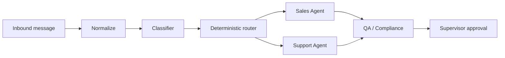

# Agents

Sagad OS v0.1 keeps the agent model intentionally small.

## Included Agents

| Agent | Scope |
|---|---|
| Sales Agent | Sizing, pricing, purchase readiness, lead qualification |
| Support Agent | Order status, returns, refunds, account support, tool failures |

Discovery is not a separate agent in v0.1. Sales and Support agents ask probing questions when the customer intent is unclear.

## Workflow

Agents should use approved knowledge, calculate a trust score, and never perform high-risk writes without an approval path.

