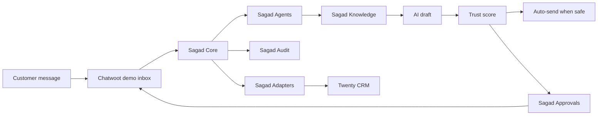

# Architecture

The v0.1 architecture is a supervised AI operations loop.

## Product Modules

| Module | Responsibility |
|---|---|
| Sagad Core | Orchestration engine and operating state |
| Sagad Agents | Sales and Support AI agents |
| Sagad Knowledge | Ingestion, review, SOP, policy, FAQ, embeddings, and retrieval layer |
| Sagad Approvals | Supervisor review and action queue |
| Sagad Adapters | Chatwoot, Twenty, webhooks, and future tools |
| Sagad Audit | Decision trail for every AI action |
| Sagad Console | Operator UI for supervisors and admins |

## Runtime Boundary

The browser never calls Chatwoot, Twenty, MCP, or provider APIs directly. Agent Studio owns credentials, health checks, retries, write gates, and audit metadata.

Knowledge ingestion follows the same boundary. The console can show sources, documents, jobs, and review state, but Agent Studio owns file parsing, OpenAI embeddings, pgvector writes, document approval, retrieval filters, and audit events.
