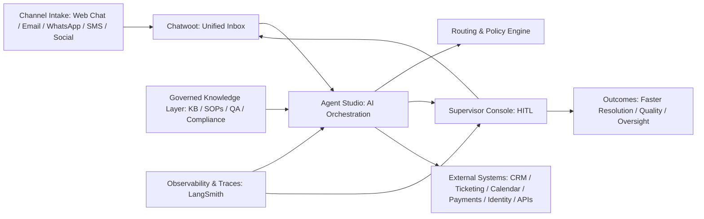
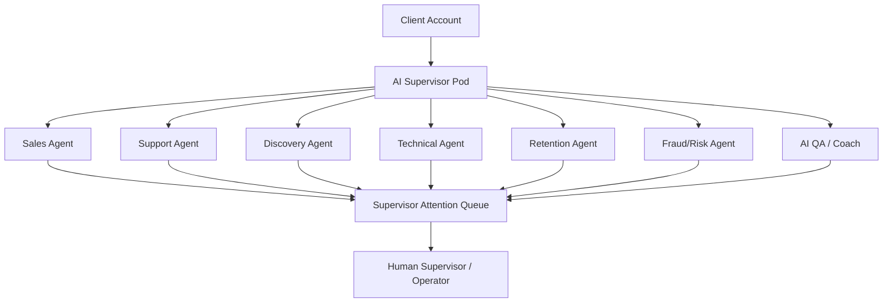

# Sagad OS Platform Architecture

Sagad OS is an open-source, self-hostable AI-native BPO platform. It receives customer conversations through Chatwoot, runs typed Agent Studio orchestration with LangGraph and LangChain, gathers CRM and governed knowledge context, drafts replies, applies confidence and guardrail checks, requests human approval when needed, sends the approved response, and records operational logs and LangSmith traces.

Sagad OS is its own platform. It does not replace every tool. It coordinates Chatwoot, Twenty CRM, LangSmith, generic webhooks, future MCP servers, and client internal systems through adapter contracts owned by Agent Studio. n8n is not part of the core Sagad OS architecture or orchestration.

## Core Runtime Flow

```text
channel message
-> Chatwoot unified inbox
-> Agent Studio webhook/API
-> typed LangGraph state
-> intent understanding
-> planning and policy routing
-> governed knowledge retrieval
-> tool plan through adapters
-> response draft
-> quality, confidence, and risk check
-> Supervisor Console HITL decision
-> approved reply or approved external action
-> LangSmith trace + audit + external system update
```

The router should stay deterministic. The classifier decides labels. The router obeys those labels. Specialist agents handle the domain work.

## Canonical Architecture Graph



## Runtime Layers

| Layer | Responsibility | First Implementation |
| --- | --- | --- |
| Channel | Receive and send messages across web chat, email, WhatsApp, SMS, social, or future voice | Chatwoot adapter first, generic webhooks later |
| Intake | Debounce, group, normalize, and persist inbound messages | Agent Studio webhook/API and typed LangGraph state |
| Classification | Identify intent, route, contact driver, confidence, and reason | LangChain chat model call with structured output |
| Routing | Send the conversation to the correct specialist path | Switch node, later deterministic graph edge |
| Agent | Draft a useful reply inside role boundaries | Sales, support, discovery agents first |
| Knowledge | Provide FAQs, SOPs, guides, policies, and retrieval context | Static docs first, RAG later |
| Tools | Read/write CRM, tickets, notes, tags, tasks, lead stages, and approved webhooks through adapters | Twenty, Chatwoot, generic webhooks, and future MCP after base loop works |
| Supervisor | Check risk, confidence, SLA, AHT, driver, and policy | Rules first, agentic supervisor later |
| HITL | Decide approve, edit, reject, take over, or auto-send | Supervisor queue |
| Observability | Trace decisions, latency, quality, confidence, alerts, and anomalies | LangSmith |

## AI Supervisor Pod Model



Agents ping the supervisor when confidence is low, risk is high, sentiment is negative, a tool fails, a contact driver is sensitive, SLA is at risk, or human takeover is needed.

## Canonical Classification Output

```json
{
  "intent": "pricing_question",
  "route": "sales",
  "contact_driver": "pricing_inquiry",
  "confidence": 0.86,
  "risk_level": "low",
  "verification_required": "none",
  "reason": "The customer asked how much the service costs."
}
```

## Design Rules

- Classification can be probabilistic; routing should be deterministic.
- High-risk actions require verification and human oversight.
- Specialist agents should have scoped tools, not global access.
- Contact drivers are first-class data, not freeform notes.
- Every AI decision should be traceable through LangSmith or an equivalent log.
- CRM notes should summarize customer-facing action, not expose internal prompts.
- Twenty CRM is external infrastructure and must be called only by Agent Studio, never by browser components.
- Generic webhooks are connector primitives; n8n is not core Sagad OS orchestration.
