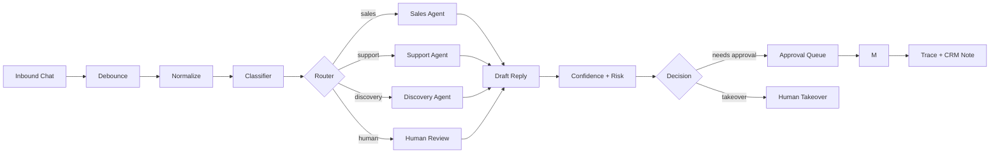

# Level 1 Service Business MVP

Level 1 is the first real build target for Sagad OS. It focuses on service businesses with inbound sales and support conversations. The MVP should prove that Sagad OS can receive a message, understand why the customer is contacting the business, route the conversation, draft a useful response, involve a human when needed, and log what happened.

## Scope

In scope:

- website or message-based inbound chat
- debounce/group messages
- classifier with structured output
- deterministic router
- Sales Agent, Support Agent, Discovery Agent
- contact driver classification
- confidence score and simple risk level
- human approval queue
- HITL-approved response payload
- CRM note/log output
- LangSmith trace capture in the durable version

Out of scope:

- voice calls
- full BPO workforce management
- fraud/insurance/finance compliance flows
- complex QA automation
- multi-account staffing optimization
- autonomous sends or fully autonomous high-risk actions
- deep analytics beyond the minimum operating metrics

## MVP Flow



## Classifier Contract

The classifier should return structured data that the router and dashboard can trust.

```json
{
  "intent": "pricing_question",
  "route": "sales",
  "contact_driver": "pricing_inquiry",
  "confidence": 0.86,
  "risk_level": "low",
  "verification_required": "none",
  "reason": "The user asked how much the service costs."
}
```

Allowed Level 1 routes:

- `sales`
- `support`
- `discovery`
- `human`

Level 1 routing rules:

- `sales`: pricing, services, packages, quote requests, demo requests, buying intent
- `support`: complaint, existing customer issue, account/service problem
- `discovery`: empty, greeting-only, vague, unclear, "tell me more"
- `human`: sensitive, angry, high-risk, private-account action without verification

## Agent Scope

| Agent | Job | Should Ask For | Should Not Do |
| --- | --- | --- | --- |
| Sales Agent | Qualify and move the lead to the next useful step | goal, service interest, timeline, budget if appropriate | promise outcomes, invent prices, handle private support issues |
| Support Agent | Help with existing service/account problems | account verification before private help, issue details | expose private data, promise refunds, skip verification |
| Discovery Agent | Probe unclear messages | one simple clarifying question | sell aggressively, assume intent, ask many questions |

## Minimum Dashboard

The MVP dashboard should help humans supervise AI decisions without opening Chatwoot admin views, Twenty CRM, webhook logs, or raw traces.

```text
AI Supervisor Console
+-- Attention Queue
|   +-- Needs Approval
|   +-- Low Confidence
|   +-- Escalated
|   +-- Failed Tool/Send
+-- Conversation Review
|   +-- customer message
|   +-- intent / route / driver
|   +-- confidence / risk
|   +-- AI draft
|   +-- CRM context
|   +-- approve / edit / reject / take over
+-- Agent Activity
|   +-- sales
|   +-- support
|   +-- discovery
+-- Settings
    +-- confidence thresholds
    +-- routing rules
    +-- agent prompts
    +-- approval rules
```

Low-fi layout:

```text
+------------------------------------------------------------------+
| Sagad AI Supervisor Console                Search     Org/User   |
+---------------+-----------------------------+--------------------+
| Queue         | Conversations                | Review Panel       |
| Approval      | John D.                      | Contact: John D.   |
| Low Conf      | "How much is this?"          | Intent: pricing    |
| Escalated     | Route: sales                 | Driver: pricing    |
| Failed        | Confidence: 82%              | Risk: low          |
|               |                             | Draft Reply        |
| Agents        | Maria S.                     | [editable draft]   |
| Sales         | "I need help logging in"     |                    |
| Support       | Route: support               | [Approve] [Edit]   |
| Discovery     | Confidence: 71%              | [Reject] [Takeover]|
+---------------+-----------------------------+--------------------+
```

## Study And Test Scenarios

| Scenario | Expected Result |
| --- | --- |
| User asks "How much is your service?" | route `sales`, driver `pricing_inquiry`, draft sales reply |
| User says "hello" | route `discovery`, ask one probing question |
| User says "I cannot access my account" | route `support`, ask for verification before private help |
| User sends an empty message | route `discovery`, confidence low, ask what they need |
| User is angry or asks for refund/payment action | route `human` or support with approval required |
| CRM lookup fails | safe fallback, no invented account details, log tool failure |
| Confidence is medium | send to approval queue before response |
| Confidence is high and risk is low | mark as low-risk and route to approval; future account policy may allow auto-send later |

## Metrics For Level 1

- total conversations
- route distribution
- contact driver distribution
- average confidence
- auto-send eligibility rate
- approval rate
- human takeover rate
- tool failure rate
- response time
- lead conversion proxy, such as booked call or qualified lead

## Build Principle

Level 1 should stay narrow. Prove the loop for service businesses first:

```text
understand -> route -> draft -> supervise -> respond -> record
```

Once that loop works, add external CRM and MCP tools through Agent Studio adapters, stronger supervisor rules, QA scoring, and then expand into retail, SaaS, BPO, and high-risk accounts.
