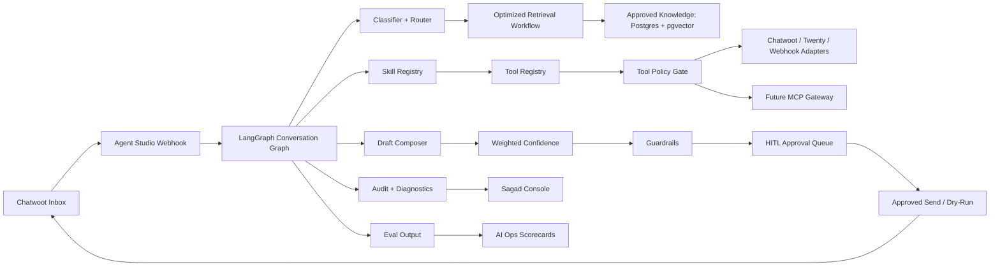

# Sprints 2-4 Reference Architecture

This architecture assumes Sprint 1 already proves the supervised Chatwoot loop.

## System Shape After Sprint 4



## Module Responsibilities

| Module | Responsibility |
|---|---|
| `graph.py` | Controls node order and state transitions. |
| `retrieval.py` | Existing low-level retriever over in-memory or Postgres/pgvector. |
| `retrieval_workflow.py` | Query planning, source pack building, confidence, missing knowledge. |
| `confidence.py` | Weighted final confidence scoring. |
| `guardrails.py` | HITL/escalation/auto-send constraints. |
| `skill_registry.py` | Internal graph capabilities and agent skills. |
| `tool_policy.py` | Tool capability manifests and allow/block/dry-run decisions. |
| `mcp_gateway.py` | Future MCP facade over approved tools. |
| `evals.py` | Evaluation cases, results, and summaries. |
| `observability.py` | Stable event names, trace attrs, redaction, diagnostics payloads. |
| `store.py` | Conversation, approval, event, and tool-result persistence. |
| `schemas.py` | API and persisted DTO shapes. |

## Graph Shape

```text
normalize_message
-> classify_message
-> route_agent
-> plan_retrieval
-> retrieve_candidates
-> build_source_pack
-> detect_missing_knowledge
-> plan_skills
-> plan_tools
-> evaluate_tool_policy
-> draft_reply
-> score_confidence
-> apply_guardrails
-> decide_delivery
-> create_or_update_approval
-> record_audit_events
```

## Data Contracts To Stabilize

### Retrieval Pack

```text
query_plan
selected_sources
missing_knowledge
retrieval_confidence
retrieval_reasons
```

### Confidence Breakdown

```text
retrieval_confidence
groundedness_score
policy_safety_score
intent_clarity_score
tool_risk_score
final_score
decision
reasons
```

### Guardrail Decision

```text
decision
hard_block
requires_human
findings
reasons
```

### Tool Decision

```text
tool_name
allowed
requires_approval
dry_run
blocked_reason
policy_reasons
```

### Eval Output

```text
eval_case_id
passed
score
failures
metadata
```

## Operational Boundaries

### Browser Boundary

The Console can display state and submit approvals.

The browser must not:

```text
hold Chatwoot credentials
hold Twenty credentials
call MCP servers directly
call provider APIs directly
execute tools directly
see raw secrets
```

### Agent Studio Boundary

Agent Studio owns:

```text
provider credentials
tool policy
tool execution
approval gates
retrieval filters
audit events
diagnostics redaction
future MCP server exposure
```

### MCP Boundary

MCP is a future facade, not the control plane.

```text
MCP exposes only what Agent Studio policy allows.
Agent Studio remains the source of truth for permissions, approval, audit, and dry-run mode.
```

## Deployment Boundary Through Sprint 4

Keep the stack simple:

```text
Next.js Console
FastAPI Agent Studio
LangGraph
Postgres + pgvector when configured
Chatwoot
Twenty CRM read/write-gated tools
LangSmith optional
Docker/Compose
```

Avoid adding Temporal, Kubernetes, or a production policy engine until the quality loop is stable.
