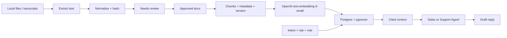

# Knowledge Pipeline

Operator language: this is the approved answer source. Developer language: this is the RAG layer.

## Sources

v0.1 starts with local, governed source ingestion:

- Markdown and text files;
- transcripts and conversation exports;
- PDFs with embedded text;
- DOCX process documents;
- XLSX and CSV sheets;
- existing Markdown packs for FAQs, SOPs, QA rubrics, compliance rules, escalation rules, and approved templates.

New imports start as `needs_review`. Operators approve the document before it can become an approved answer source for agents.

## Ingestion And Retrieval Flow

Sagad Postgres with pgvector is the retrieval index. It is not the source of truth. Source files, document records, approval status, versions, and audit events remain the governed knowledge record.

## Staleness Rules

- Duplicate detection uses source path plus content hash.
- Changed documents create a new version; old chunks are retired after the new version is approved.
- Scanned PDFs without embedded text are rejected with an OCR-needed error.
- Google Drive, Notion, Confluence, and websites are later source adapters. They should sync through Agent Studio, not browser code.
