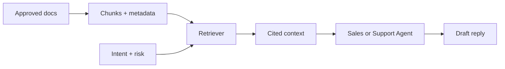

# Knowledge Pipeline

Operator language: this is the approved answer source. Developer language: this is the RAG layer.

## Sources

v0.1 starts with Markdown knowledge packs:

- FAQs;
- SOPs;
- QA rubrics;
- compliance rules;
- escalation rules;
- approved templates.

## Retrieval Flow

Future versions can move from in-memory search to Postgres `pgvector`, but the source of truth remains governed knowledge.

