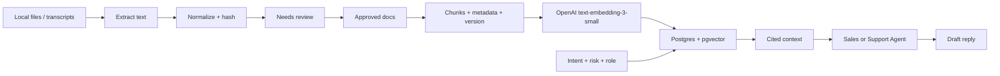

# Knowledge Pipeline

Operator language: this is the approved answer source. Developer language: this is the RAG layer.

## Sources

v0.1 starts with local, governed source ingestion:

- Markdown and text files;
- transcripts and conversation exports;
- PDFs with embedded text;
- DOCX process documents;
- XLSX and CSV sheets;
- existing Markdown packs for FAQs, SOPs, QA rubrics, compliance rules, escalation rules, and approved templates.

New imports start as `needs_review`. Operators approve the document before it can become an approved answer source for agents.

## Ingestion And Retrieval Flow

Sagad Postgres with pgvector is the retrieval index. It is not the source of truth. Source files, document records, approval status, versions, and audit events remain the governed knowledge record.

## Staleness Rules

- Duplicate detection uses source path plus content hash.
- Changed documents create a new version; old chunks are retired after the new version is approved.
- PDFs are parsed with layout awareness using **IBM Docling** when `SAGAD_DOCLING_ENABLED=true` (which handles complex structures like tables, columns, and headers). If disabled or fails, the parser falls back to `pypdf` text extraction and scanned PDFs run local Tesseract OCR when `SAGAD_OCR_ENABLED=true`. Otherwise, ingestion returns `ocr_required`, `ocr_unavailable`, or `ocr_failed`.
- Local uploads and extracted documents can be re-indexed on command from stored extracted content. Google Drive, Notion, Confluence, Guru, websites, and true external source sync are later source adapters. They should sync through Agent Studio, not browser code.

## Post-Retrieval Reranking
To improve citation precision, we perform a two-stage retrieval pipeline:
1. **Semantic Search**: Postgres with `pgvector` retrieves a larger initial candidate pool of chunks (e.g. top 15 results).
2. **Reranking**: If `RERANK_ENABLED=true`, a cross-encoder reranking model (e.g., Cohere/Jina reranking models via OpenRouter or LiteLLM) re-scores and re-orders the candidate list. The agent is then provided only the top `limit` results (default 4), reducing prompt context size and cost while boosting accuracy.

