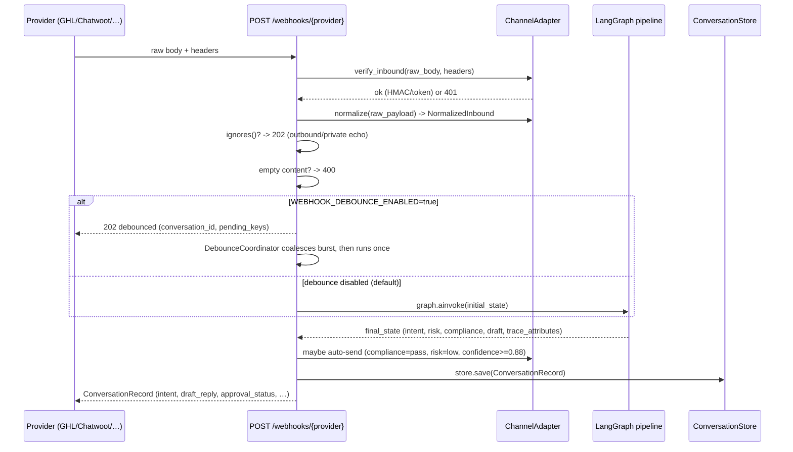

# Universal Webhook Pipeline

Sagad OS accepts inbound messages from any provider through a single universal webhook
route, normalized behind a `ChannelAdapter`. The dedicated Chatwoot route is preserved for
back-compat; new providers (GHL today, others later) plug in via the adapter registry.

## Routes

| Route | Adapter | Notes |
|---|---|---|
| `POST /webhooks/chatwoot` | Chatwoot (dedicated) | Existing route, unchanged. 14 sync tests guard it. |
| `POST /webhooks/{provider}` | `registry.get_adapter(provider)` | Universal. `provider` is lowercased/stripped; unknown → 404. |

The universal route dispatches to `agent_studio/adapters/registry.py`. A provider is
served by the universal route iff an adapter is registered for it. `chatwoot` keeps its
own route so its synchronous `ConversationRecord` contract is preserved exactly.

## Pipeline

### Steps
1. **Verify** — `adapter.verify_inbound(raw_body, headers)`. GHL uses HMAC-SHA256 of the
   raw body vs `X-GHL-Signature` (constant-time). Chatwoot uses the `?token=` query.
   Missing/invalid → 401. No secret configured → no-op (dev/test).
2. **Normalize** — `adapter.normalize(raw_payload) -> NormalizedInbound` with
   `provider`, `provider_conversation_id`, `provider_message_id`, `customer_name`,
   `channel`, `message_text`, `event_type`, `raw_payload`, `extra`.
3. **Ignore filter** — `adapter.ignores(normalized)` drops outbound/private echoes → 202.
4. **Dedup** — `_message_already_recorded` skips a replayed `provider_message_id`.
5. **Conversation id** — `{provider}_{_safe_id_part(ref)}` where `ref` is the provider
   conversation id (or message id). `_safe_id_part` keeps `[a-z0-9_-]`.
6. **Graph** — `graph.ainvoke` runs normalize → classify → deterministic router →
   supervisor (agents-as-tool) → guardrail. Produces `intent`, `risk_level`,
   `compliance_status`, `draft_reply`, `trace_attributes`, `trace_url`.
7. **Auto-send gate** — `_maybe_auto_send_universal` sends the draft through the adapter
   only when `compliance == "pass"` AND `risk == "low"` AND `confidence >= 0.88` AND the
   draft is non-empty. Otherwise `approval_status = needs_approval`, `send_status = not_sent`.
8. **Persist + broadcast** — `store.save` + a realtime broadcast + diagnostic events per
   stage (`{provider}.webhook.received`, `.normalized`, `.classified`, …).

## Debouncing (opt-in)

`WEBHOOK_DEBOUNCE_ENABLED=true` (default **false**) makes the universal/GHL handler return
`202 debounced` immediately and coalesce a burst of messages on the same
`{provider}_{conversation_id}` into a single `graph.ainvoke` after `WEBHOOK_DEBOUNCE_MS`
(default 2500). The timer resets on each new message. Results are observable via
`GET /conversations/{id}` and `/diagnostics/events`. Disabled by default so the
synchronous `ConversationRecord` contract (and the Chatwoot tests) is preserved.

## Traces

`trace_attributes` is built in `run_guardrail` and persisted on the conversation. Per-stage
diagnostic events are recorded for each webhook → normalize → classify → supervisor → tool
→ guardrail step, visible at `/diagnostics/events`. `trace_url` is non-null when LangSmith
tracing is enabled; otherwise `None` (fine).

## Adding a provider

1. Implement `ChannelAdapter` (`name`, `verify_inbound`, `normalize`, `ignores`,
   `send_outbound`) in `agent_studio/adapters/<provider>.py`.
2. Register it in `agent_studio/adapters/registry.py` (`_REGISTRY`).
3. Widen `IntegrationProvider` in `schemas.py` + the `integration_connections.provider`
   CHECK constraint via a new idempotent migration.
4. Add `agent-studio/tests/test_<provider>_adapter.py` (verify/normalize/ignores/send) and
   `tests/test_universal_webhook.py` cases.

See `docs/adapters/ghl.md` for a worked example.