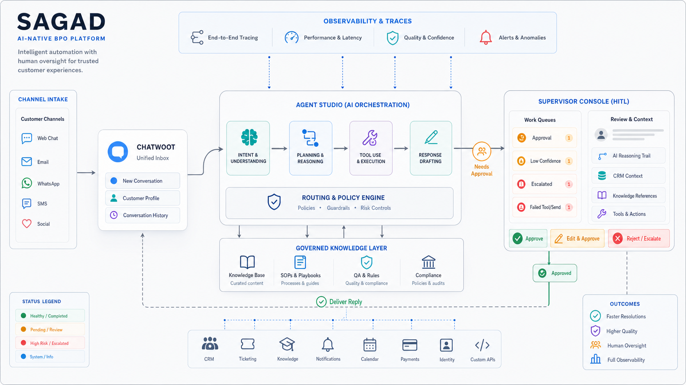
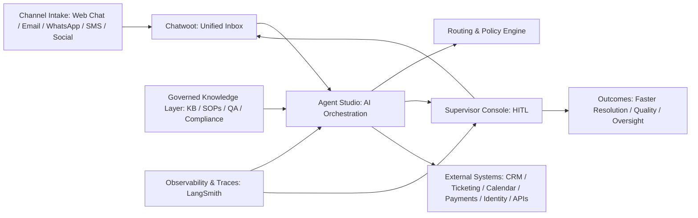
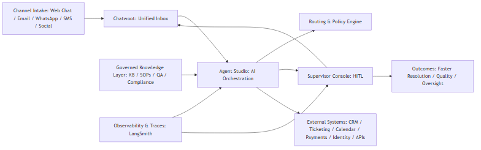
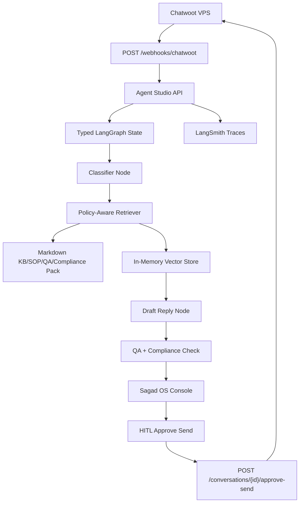
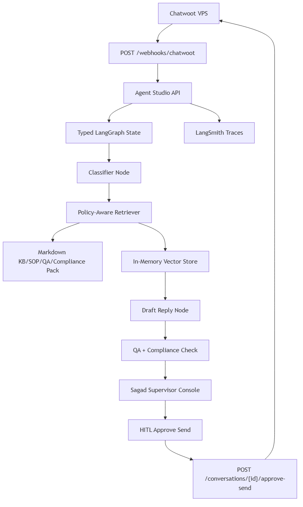

# System Architecture Blueprint

## Summary

Sagad OS is the open-source AI operations layer for BPO-style teams. It sits above client channels and tools, runs typed Agent Studio workflows, retrieves governed knowledge, routes work to supervisors, and only sends live replies after approval.

## Canonical Reference Architecture

This is the source-of-truth structure for docs, UI copy, memory updates, and implementation plans.

## Working Preview Architecture

## Responsibilities

- Chatwoot owns live web chat intake and delivery.
- Agent Studio owns LangGraph/LangChain orchestration, normalization, classification, retrieval, drafting, QA/compliance checks, approval state, and outbound send policy.
- Sagad OS Console owns queue visibility, review, and supervisor approval.
- Twenty CRM stays external and is reached only through Agent Studio adapter endpoints.
- Generic webhooks can connect external apps later through Agent Studio policy gates.
- Markdown knowledge packs are the first source of truth for KB, SOPs, QA, compliance, escalations, and approved templates.
- LangSmith is optional in dev and records traces when configured.

## Non-Goals

- No auto-send in the first live loop.
- No browser-direct Twenty, Chatwoot, webhook target, MCP, or internal-system calls.
- No MCP server until the adapter boundary is proven.
- No production auth or persistent audit store in the first preview.
