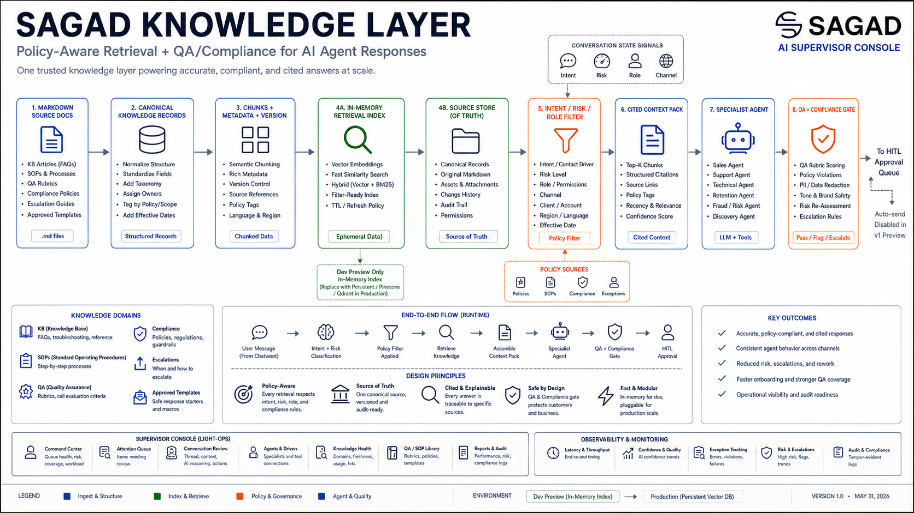
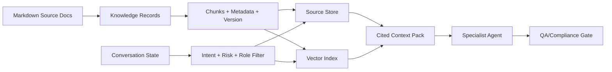
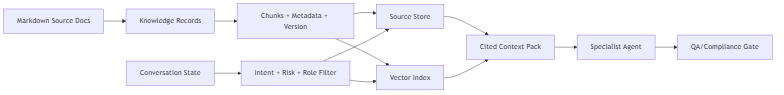

# Knowledge Architecture Blueprint

## Summary

The knowledge layer is the operating system for both human agents and AI agents. Vector search is only the retrieval index; Markdown knowledge records remain the governed source of truth in the first preview.

## Knowledge Flow

## First Knowledge Pack Categories

- `kb`: product/service facts, pricing language, FAQs.
- `sops`: step-by-step workflows for support, booking, verification, handoff, and follow-up.
- `qa`: rubric criteria used by supervisors and AI review nodes.
- `compliance`: hard rules, blocked claims, identity verification requirements, and approval thresholds.
- `escalations`: refund, cancellation, angry customer, failed tool, and high-risk handling.
- `approved_templates`: safe response language that can be reused in drafts.

## Retrieval Rule

Agent Studio must filter retrieval by client, channel, intent, risk, agent role, and approval status before passing context to an agent. Agents should receive cited context packs, not unrestricted document search.
