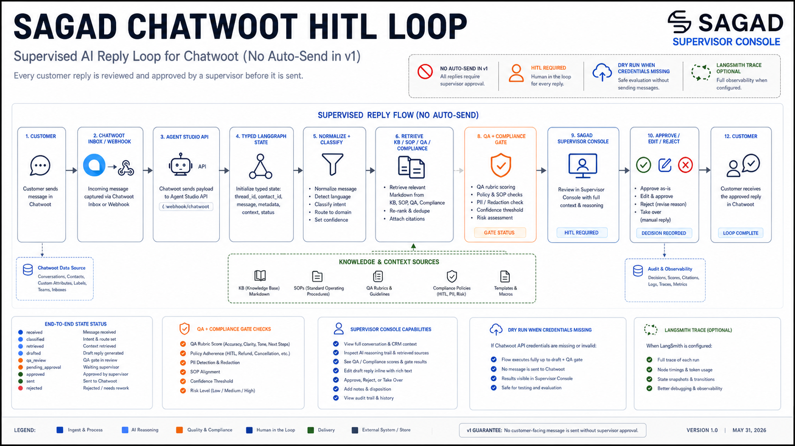
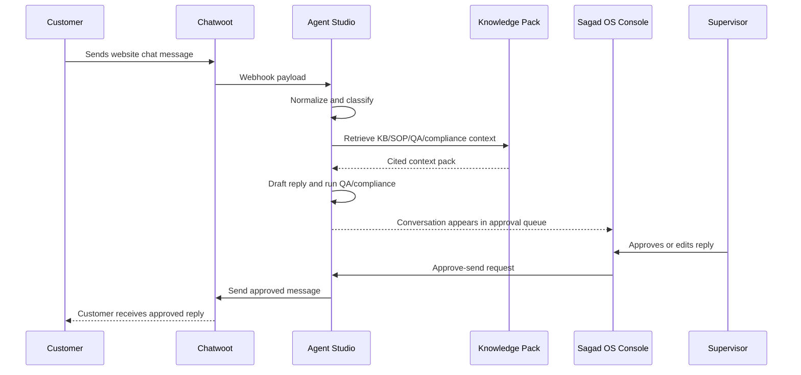
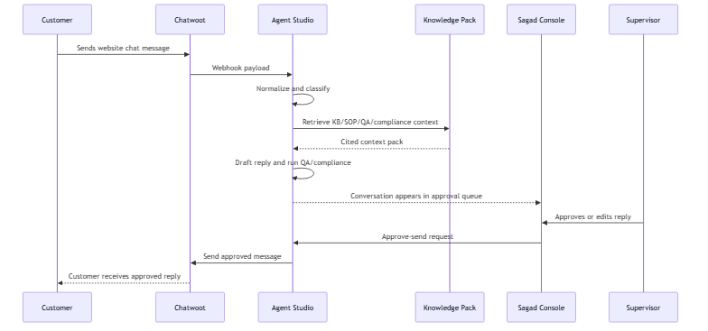

# Chatwoot HITL Loop Blueprint

## Summary

The first live preview connects a Chatwoot inbox to Agent Studio and the Sagad OS Console. It proves the full loop without allowing autonomous live replies.

## Flow

## Safety Rules

- The backend receives real Chatwoot messages.
- The AI can draft and recommend actions.
- Only HITL-approved replies can be sent.
- If Chatwoot send fails, the conversation remains visible with failed send status.
- If knowledge retrieval fails, the draft must use a safe fallback and require review.
