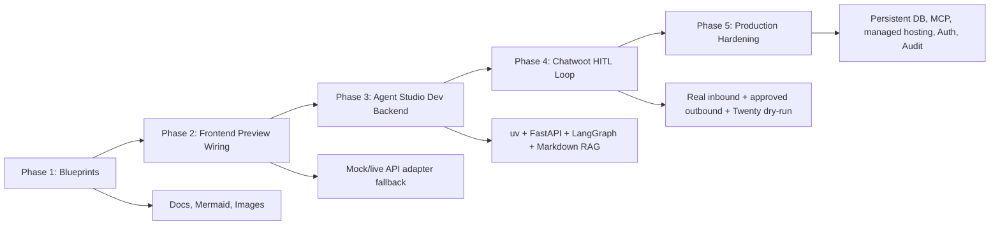
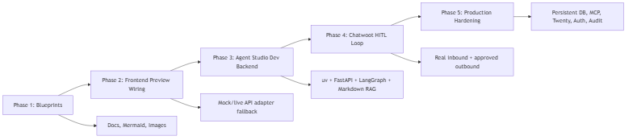

# Implementation Phases Blueprint

## Summary

Sagad OS should ship in phases. The early work must prove the operator workflow before adding persistent vector stores, MCP servers, managed hosting, or enterprise hardening.

## Roadmap

## Phase Commitments

- Phase 1 documents the architecture.
- Phase 2 makes the console ready for live preview states.
- Phase 3 adds a local Agent Studio backend.
- Phase 4 proves Chatwoot inbound, HITL outbound, and external Twenty adapter readiness.
- Phase 5 turns the preview into a production service.
