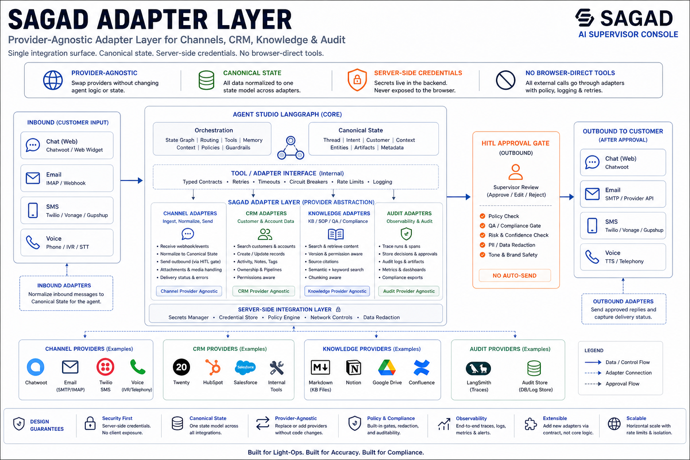
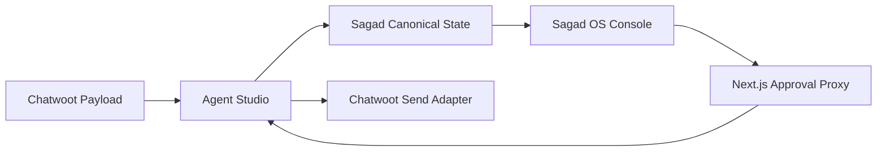
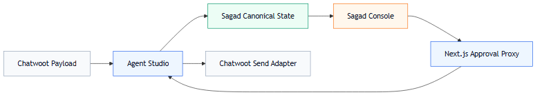
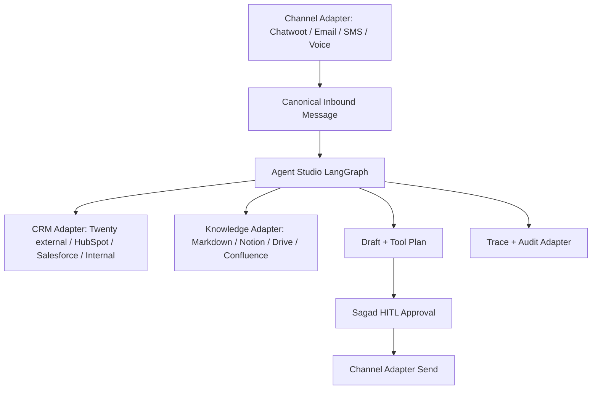
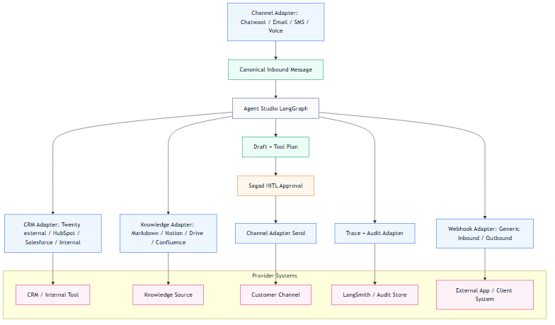

# Adapter Architecture Blueprint

## Summary

Adapters make Sagad OS tool-agnostic. Agent Studio talks to stable adapter contracts instead of hardcoding Chatwoot, Twenty, HubSpot, Salesforce, Kustomer, Gladly, Genesys, generic webhook targets, or internal client systems into graph nodes.

Sagad OS does not replace every tool. It coordinates them. Twenty CRM is the selected first CRM target, but it remains externally hosted and separate from Sagad OS.

## Current Preview Flow

## Target Adapter Architecture

## Adapter Families

- `channels`: normalize inbound messages and send approved replies.
- `crm`: read customer context, create notes, create tasks, and update lifecycle state. Twenty CRM starts disabled/dry-run and is configured only in Agent Studio.
- `knowledge`: retrieve cited KB, SOP, QA, compliance, and template context.
- `webhook`: trigger external systems through approved inbound or outbound webhooks.
- `audit`: log graph runs, approvals, tool results, failures, and trace links.

## Implementation Rule

LangGraph nodes should call adapter interfaces, not provider SDKs directly. Provider-specific logic belongs in adapter modules so each client stack can be swapped without rewriting the graph.

The browser never calls external providers directly. Credentials, write gates, retries, rate-limit handling, and audit metadata belong in Agent Studio.
