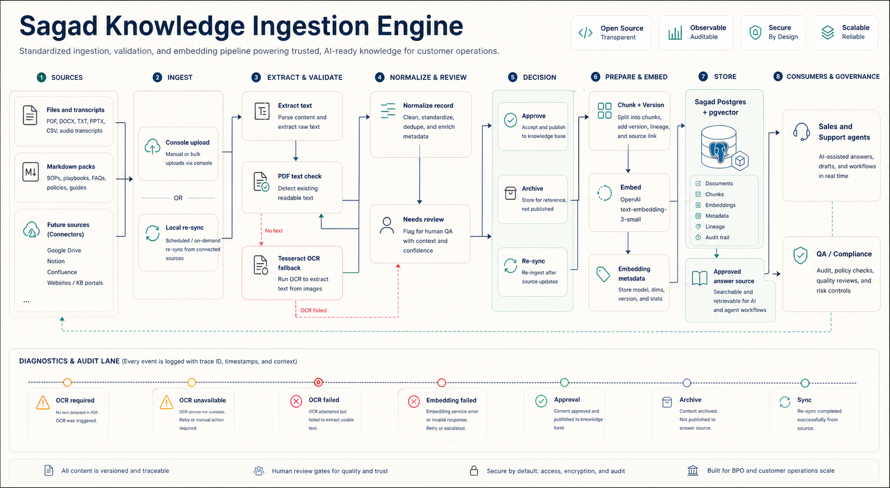
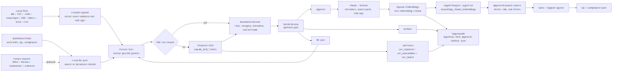

# Ingestion Engine Blueprint

## Summary

The Sagad Knowledge Ingestion Engine turns operational source material into a governed approved answer source. Agent Studio owns the ingestion runtime, file parsing, review state, embedding calls, pgvector writes, and audit trail. The Console only shows source status, review queues, ingestion jobs, and missing knowledge.

## Technical Diagram

The Mermaid source is `diagrams/ingestion-engine.mmd`. Rendered technical assets are available as:

- `images/ingestion-engine.svg`
- `images/ingestion-engine.png`

## First Slice

Local ingestion ships first. Supported first-pass inputs are Markdown, TXT, transcripts, PDF, DOCX, XLSX, and CSV. Google Drive, websites, Notion, Confluence, and external KBs are future source adapters behind Agent Studio.

New imports start as `needs_review`. They are not available to Sales or Support agents until a supervisor, admin, or QA operator approves the document.

## Runtime Flow

```mermaid
flowchart LR
  Source["Source Content"] --> Extract["Extract Text"]
  Extract --> Normalize["Normalize Record"]
  Normalize --> Review["Needs Review"]
  Review --> Approved["Approved Knowledge"]
  Approved --> Chunk["Chunk + Version"]
  Chunk --> Embed["OpenAI Embeddings"]
  Embed --> Vector["Postgres + pgvector"]
  Vector --> Retrieve["Approved Answer Source"]
  Retrieve --> Agent["Sales / Support Agent"]
```

## Governance Rules

- pgvector is the retrieval index, not the source of truth.
- Reviewable knowledge records remain the source material.
- SOP, QA, compliance, refund, cancellation, billing, and verification content must remain approval-gated.
- PDFs are parsed directly when text is embedded. Scanned PDFs run local Tesseract OCR when `SAGAD_OCR_ENABLED=true`; otherwise they return `ocr_required`, `ocr_unavailable`, or `ocr_failed` with readable operator guidance.
- Duplicate content is detected by source path and content hash.
- Retrieval filters by organization, category, approval status, intent, risk, and agent role where available.

## Sync And Staleness

Manual uploads and extracted documents can be re-indexed locally from stored extracted content on command. Google Drive, websites, Notion, Confluence, Guru, raw file storage, and scheduled remote sync stay deferred until source adapters exist. Stale content should be flagged when it has not been reviewed for six months.
