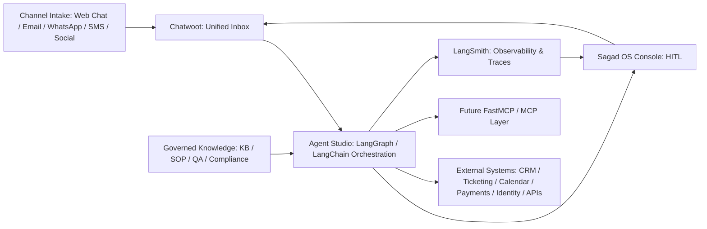

# Sagad OS System Design

## Summary

Sagad OS is an open-source, self-hostable AI-native BPO platform. The `v1/` console is the first supervisor UI for a home services demo account. It is built as a Next.js App Router application with TypeScript, Tailwind, typed local mocks, and an optional Agent Studio dev-preview adapter.

Sagad OS does not replace every tool. It coordinates Chatwoot, Twenty CRM, LangSmith, generic webhooks, future MCP servers, and client internal systems through Agent Studio adapter boundaries.

## System Boundary

v1 runs in the Next.js frontend runtime. By default it uses local mocks. When `SAGAD_API_BASE_URL` is configured, server-rendered routes may read the root Agent Studio preview API.

Included:

- App Router pages and layouts;
- React components;
- Tailwind styling;
- TypeScript domain types;
- local mock datasets;
- simulated UI state.
- optional read-only Agent Studio preview data.

Excluded from the v1 console:

- browser-direct webhook execution;
- Supabase persistence;
- production LangGraph automation beyond Agent Studio preview reads;
- MCP server calls;
- authentication;
- real customer data;
- production telemetry.

## Conceptual Architecture

The full visual blueprint package lives in `docs/blueprints/`. It is the source for the Chatwoot HITL preview, knowledge architecture, and implementation phase diagrams.

```text
User
  |
  v
Next.js App Router
  |
  v
Supervisor Console UI
  |
  v
Typed Mock Data And View Models
```

Future architecture target:



Agent Studio is the orchestration layer between the Next.js console and external systems. It owns the Python LangGraph runtime, LangChain model/tool/retrieval primitives, typed state, agent routing, approval handling, tool planning, credentials, retries, audit, and LangSmith trace metadata. Twenty CRM is the selected first CRM target, but it is hosted outside Sagad OS.

## Working Preview Path

The first dev preview connects Chatwoot to Agent Studio, with Twenty CRM exposed as a disabled/dry-run external adapter:

```text
Chatwoot webhook
  -> Agent Studio FastAPI endpoint
  -> typed LangGraph workflow
  -> Markdown KB/SOP/QA/compliance retrieval
  -> draft reply and QA/compliance gate
  -> Sagad OS Console approval queue
  -> approved Chatwoot reply
```

The frontend reads Agent Studio only when `SAGAD_API_BASE_URL` is set. Without that variable, it uses local typed mocks.

## Core Domains

### Queue

The queue represents conversations or work items that need supervisor awareness. Items should expose:

- customer name;
- service category;
- channel;
- priority;
- SLA status;
- AI confidence;
- assigned owner;
- current stage;
- next recommended action.

### Conversation

The conversation view shows a timeline of inbound customer messages, AI drafts, tool suggestions, supervisor approvals, and handoffs. v1 should make it obvious which events are mock or simulated.

### AI Work Review

AI work is advisory in v1. Suggested replies, next-best actions, call summaries, and routing decisions require supervisor interpretation. Do not present AI actions as autonomous live execution.

### Approval And Escalation

Approvals are local UI states in v1. Escalations should explain why the work item needs attention, such as low confidence, overdue SLA, angry customer language, missing appointment data, or payment risk.

## Data Model Direction

Use TypeScript types before data is used by the UI. Favor narrow union types over loose strings.

Suggested domains:

- `QueueItem`
- `ConversationEvent`
- `AiSuggestion`
- `ApprovalState`
- `ServiceCategory`
- `CustomerIntent`
- `SupervisorAction`
- `SlaState`
- `Channel`

## Home Services Demo

The account should resemble a home services operator that receives calls, texts, web leads, and follow-up requests. Example services include HVAC, plumbing, cleaning, pest control, electrical, appliance repair, and roof repair.

Use fake records only. Do not include real addresses, phone numbers, customer names, or private operational data.

## Runtime Decisions

- Keep v1 state local.
- Keep mocks deterministic.
- Keep route-level components thin.
- Keep integration seams documented but inactive.
- Keep Agent Studio optional through `SAGAD_API_BASE_URL` with mock fallback.
- Keep Twenty CRM external; Sagad OS only stores adapter settings in Agent Studio.
- Treat webhooks as generic connector primitives, not n8n-specific orchestration.
- Prefer clear supervisor workflow over broad feature coverage.

## Non-Goals

- production backend design;
- database schema implementation;
- auth and permissions;
- live automation execution;
- CRM-specific integration logic;
- analytics instrumentation;
- mobile-first field technician experience.

## Verification Expectations

For documentation-only changes, review the changed files for ASCII, scope, and consistency.

For UI changes, run:

```powershell
npm run lint
npm run build
```

When the route is changed, inspect the rendered app in a browser and verify that it still reads as a supervisor console rather than a landing page.
